# Building Customizable Image Classifier
#### **Teachable Machine with OpenCV**

This article is shared on:
* [Medium](https://medium.com/@meqdad.dev)
* [Dev.to](https://dev.to/meqdad_dev)

## Opening...

Image classification plays a significant role within the field of computer vision, contributing to the resolution of numerous real-world problems. Its applications span various fields and disciplines, as we will explore in the following sections.

BUT...

### What is Image Classification?


<p align="center">


<i><a href="https://www.superannotate.com/blog/image-classification-basics">Source</a></i>
</p>

Image classification involves categorizing images -an entire image- based on their types or classes, and it serves as a fundamental task in the field of computer vision. This process finds wide-ranging applications in various domains, including object detection, medical diagnosis, security, agriculture, and entertainment.

#### Required Skills/Concepts Before Reading

Before working on this tutorial, you need to know the following skills and concepts:

* Python Programming
* Image Processing (Basics of OpenCV)
* Machine Learning Lifecycle

_Note_: This code is tested on Windows environment.

### Steps for Building Image Classifier
#### (In our case)

To build an image classifier, you need to walkthrough the following steps:
- Collecting the data (images for each class)
- Training your model (Teachable Machine from Google)
- Testing your results in browser
- Exporting trained model into Python environment
- Classifying images with trained model by using [OpenCV](https://pypi.org/project/opencv-python/) and [Teachable Machine](https://pypi.org/project/teachable-machine/) packages
- Improving and repeat if needed

## What We Are Going To Build?

We will create an image classifier that can distinguish between Arabic and English books.

We will create an image classifier that can distinguish between Arabic and English books. To collect, train, and test data, we will use [Teachable Machine](https://teachablemachine.withgoogle.com/) from Google.

After training the model, we will export it with a `.h5` extension and use it with OpenCV and Teachable Machine Python packages.

### What is Teachable Machine?

From the [official website](https://teachablemachine.withgoogle.com/):
> Teachable Machine is a web-based tool that makes creating machine learning models fast, easy, and accessible to everyone.

With Teachable Machine, you can classify images, sounds, and poses. Our focus will be on using the image classification tool within the platform.

Using Teachable Machine, we will tackle the first three steps: collect data, train the model, and evaluate the results directly in the browser.

## Starting Image Classification on Teachable Machine

After opening Teachable Machine platform, select _Image Project_.

<p align="center">
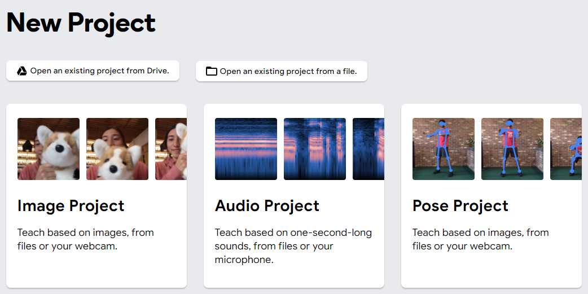
</p>

Teachable Machine offers two options to cater to different environments where image classification applications can be deployed. These environments include embedded systems with limited computing power and computers with high computing power.

<p align="center">
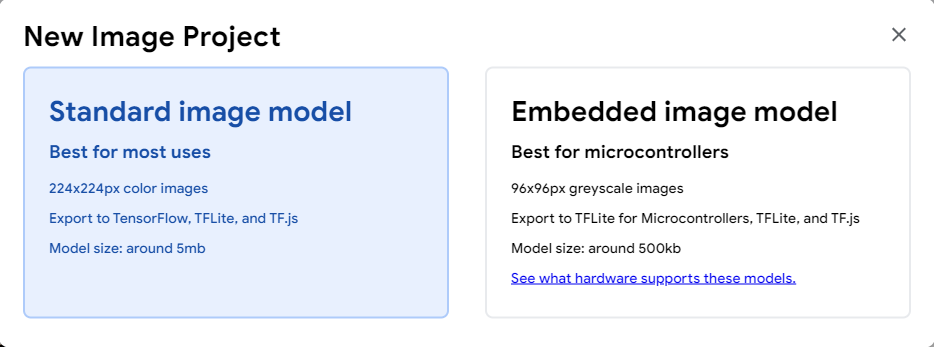
</p>

We will select the _Standard image model_ option for our choice.

### Collecting Data (Images)

As shown in the image below, on the left side we can add the classes and their data samples. You can provide samples using camera or from stored images on your computer. We will upload our image samples using camera for each class.

<p align="center">
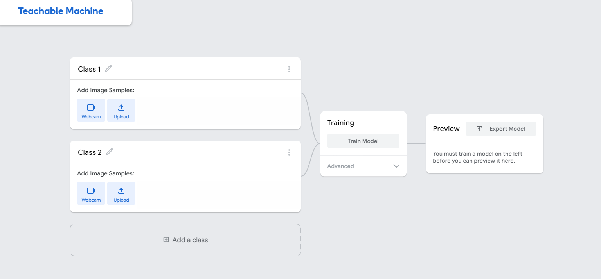
</p>

We utilized the built-in computer camera to capture screenshots of various books in both Arabic and English, as depicted in the accompanying images.

#### Arabic books:

The first one:

<p align="center">
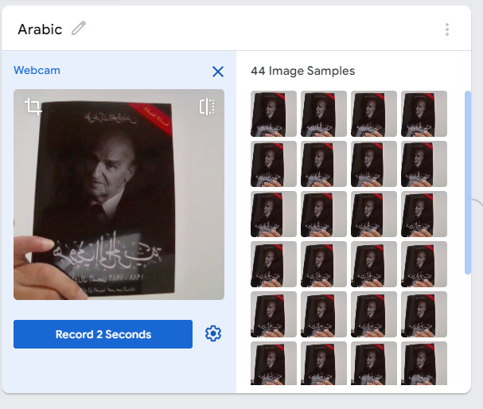
</p>

The second one:

<p align="center">
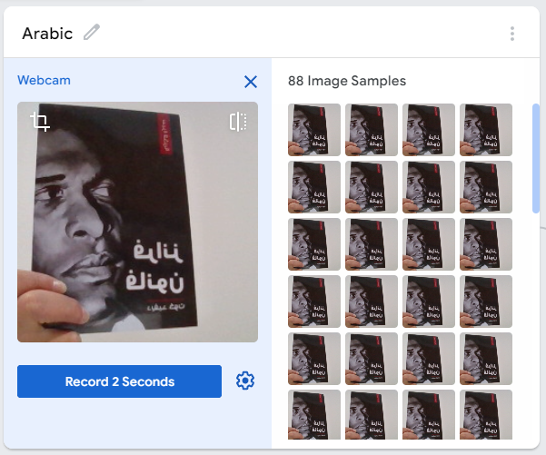
</p>


#### English books:

The first one:

<p align="center">
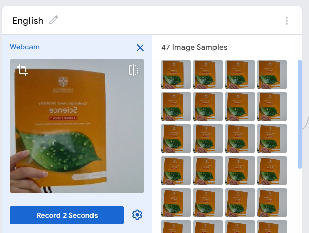
</p>

The second one:

<p align="center">
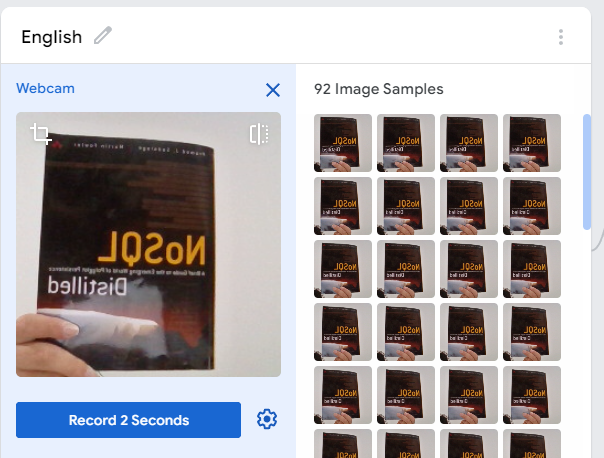
</p>

Upon completion of the data collection process, the final result will resemble the image provided.

<p align="center">
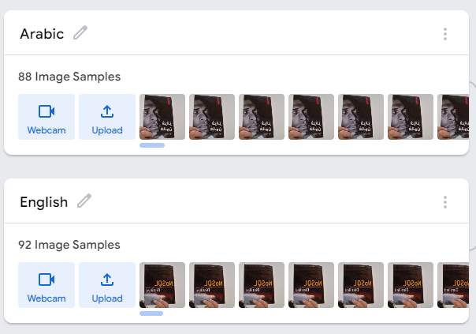
</p>

### Training Model

The training of our model is effortlessly accomplished as Teachable Machine takes care of it automatically in the background. All that is required from us is to patiently await the results.

Click on the _Train Model_ button and patiently wait for a few seconds until the training process is completed. It is important to note that you must keep your browser open on the Teachable Machine tab, as switching tabs will terminate the training session and require you to restart the training from the beginning.

<p align="center">
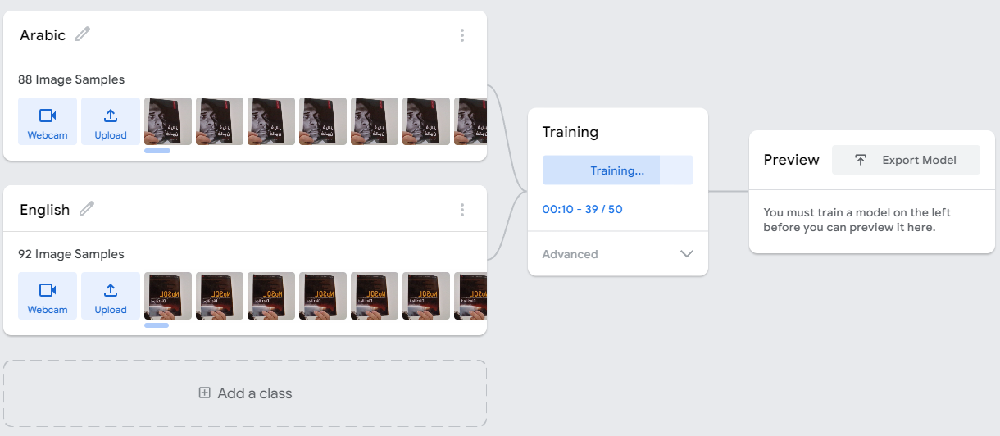
</p>


### Testing Classification Results in Browser (Preview Results)

Once the training of the model is complete, you will observe that the camera is activated, enabling you to directly evaluate the outcomes within your web browser.

<p align="center">
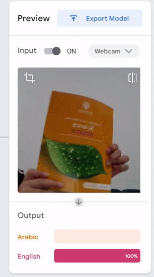
</p>

### Exporting Model

By exporting the model, we can utilize the pre-trained model in various contexts, such as gaming classification, scientific projects, and more.

In our scenario, we will export the model in Tensorflow format (.h5) to facilitate interaction with it using image processing packages and libraries like OpenCV or Pillow.

To proceed, simply click on the _Export Model_ option depicted in the image displayed below.

<p align="center">
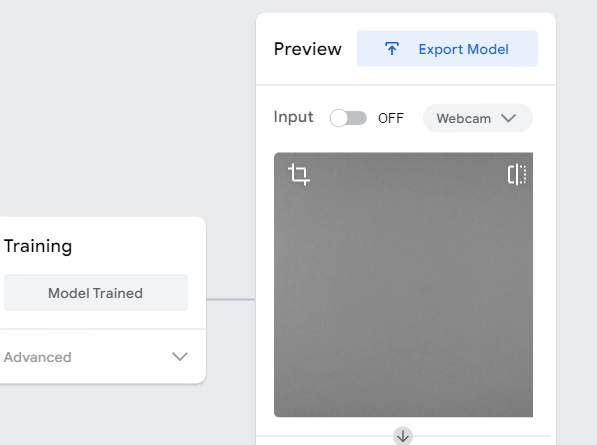
</p>

We aim to utilize the TensorFlow (Keras) `.h5` format to export our model for Python usage.

Select _TensorFlow_, _Keras_ and click on _Download my model_ button.

<p align="center">
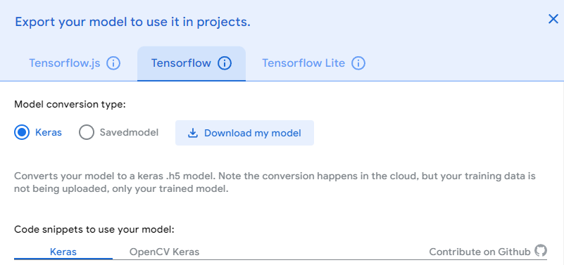
</p>

After a period of waiting, you will observe the presence of a compressed file containing two items:

* `keras_model.h5` (Our exported model)
* `labels.txt` (text file for class names with IDs)

After opening the `labels.txt` file, you should find its contents to resemble the following:

```
0 Arabic
1 English
```

### Classifying Image with Python

In the same directory, create a new Python file (e.g. named `app.py`).

It is crucial to ensure that both `keras_model.h5` and `labels.txt` reside in the same directory (relative path) as the Python file.

#### Teachable Machine Package Installation

In your terminal, use this command to download `teachable-machine` package:

```bash
pip install teachable-machine
```

